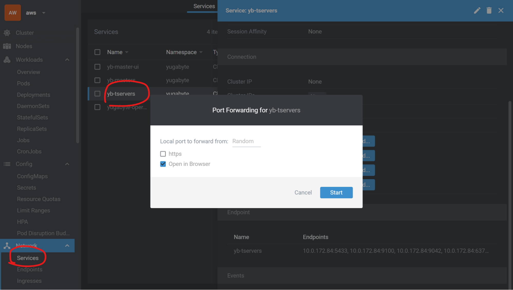
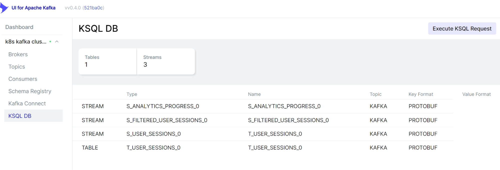
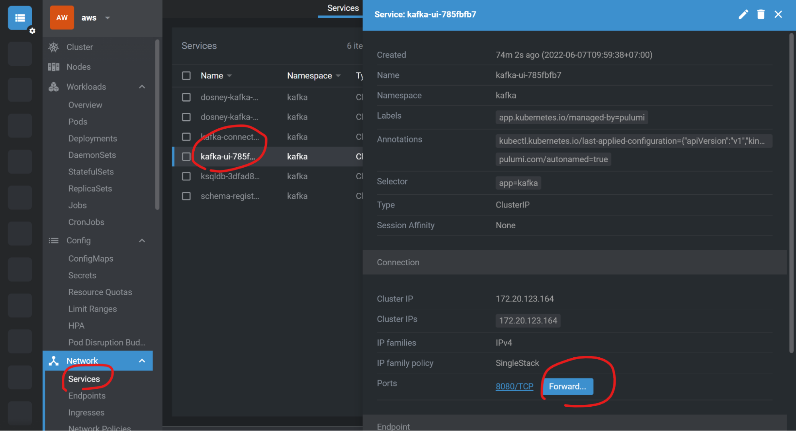

## Implementation details

Full article is here []

Let’s dive deep into the code.
All we need is just to run 2 pulumi projects:

* First `pulumi/aws-infra` to create k8s cluster
* Then `pulumi/k8s-infra` to install everything we want to k8s.

We could have the entire pulumi stack in just 1 project. But the idea is that for prod and test environments we can use different cloud providers. Prod will be in AWS, Test environment in Civo. Since k8s-infra project is cloud-agnostic our application can be run anywhere. That is what makes kubernetes so popular.


### gRPC Server

But let’s start with the easiest part.

[https://github.com/WitcherD/dosney-demo/tree/master/grpc-server](https://github.com/WitcherD/dosney-demo/tree/master/grpc-server)

.net gRPC service contains 2 simple methods:

1. Receives a heartbeat (progress update) event from the client (web or tv app or mobile app) and sends it to the kafka topic	.

``` csharp
public override async Task<UpdateProgressResult> UpdateProgress(UpdateProgressRequest request, ServerCallContext context)
    {
        var deliveryResult = await _producer.ProduceAsync("S_ANALYTICS_PROGRESS_0", new Message&lt;string, ProgressUpdated>
        {
            Key = $"{request.UserId}|{request.VideoId}",
            Value = new ProgressUpdated
            {
                VideoId = request.VideoId,
                UserId = request.UserId,
                Progress = request.Progress,
                Timestamp = DateTimeOffset.UtcNow.ToUnixTimeMilliseconds()
            }
        });

        return new UpdateProgressResult { Acknowledged = deliveryResult.Status == PersistenceStatus.Persisted };
    }
```

`Key` - property responsible for distributing the value to the right partition. So when a client watches a video all of those heartbeats will be distributed to the same kafka node.

2. Finds sessions of a user

``` csharp
public override async Task&lt;GetUserSessionsResult> GetUserSessions(GetUserSessionsRequest request, ServerCallContext context)
    {
        var sessions = await _dbContext.ProgressSessions
            .Where(i => i.UserId == request.UserId)
            .OrderByDescending(i => i.TimestampTo)
            .Skip(request.Skip)
            .Take(request.Take)
            .AsNoTracking()
            .ToListAsync(context.CancellationToken);

        return new GetUserSessionsResult { Result = { sessions.Select(i => new UserSession
        {
            VideoId = i.VideoId,
            UserId = i.UserId,
            ProgressFrom = i.ProgressFrom,
            ProgressTo = i.ProgressTo
        })}};

```

We fetch the data using Entity Framework with postgresql provider. Very simple, nothing new or interesting here.

### Migrations

Another thing worth mentioning here is how we create required topics in kafka and a yugabyte table. It will be a bit hacky, but works well for small or demo projects.

Usually we run a web server in our .net services to handle the requests, but if we pass `--migration` args in the command line we change the behavior and run the service as a console app and execute migrations there.

``` csharp
if (args.Contains("--migration"))
{
	// Migration
}
else
{
	// gRPC Service.
}
```

For Yugabyte migration we use entity framework migrations.

For Kafka migration  we call ksqlDB http endpoints to create streams through it.

[https://github.com/WitcherD/dosney-demo/tree/master/grpc-server/Dosney.Progress/Migrations](https://github.com/WitcherD/dosney-demo/tree/master/grpc-server/Dosney.Progress/Migrations)

To apply this migration pulumi will run a kubernetes job before creating a deployment:

[https://github.com/WitcherD/dosney-demo/blob/master/pulumi/k8s-infra/progress/progress-deployment.ts](https://github.com/WitcherD/dosney-demo/blob/master/pulumi/k8s-infra/progress/progress-deployment.ts)

That’s it. Build the project and push it to the docker registry. Later on in k8s-infra we will run the job with migrations and then spin up a gRPC service.

### Pulumi aws-infra

[https://github.com/WitcherD/dosney-demo/blob/master/pulumi/aws-infra/index.ts](https://github.com/WitcherD/dosney-demo/blob/master/pulumi/aws-infra/index.ts)

Our pulumi projects are just TypeScript code. With methods, loops, objects and so one. And it’s pretty self-descriptive.

To create a k8s cluster with pulumi as simple as

``` typescript
import * as eks from "@pulumi/eks";

// Create an EKS cluster with the default configuration.
const cluster = new eks.Cluster("my-cluster");

// Export the cluster's kubeconfig.
export const kubeconfig = cluster.kubeconfig;
```

But we’re going to build something much cooler. And this is [AWS Load Balancer Controller](https://github.com/kubernetes-sigs/aws-load-balancer-controller). Remember about [Crossplane](https://crossplane.io/)? AWS Load Balancer Controller was built following the same principle. It creates an Ingress Controller inside k8s cluster and ALB/ELB (including target groups, health checks etc) outside of k8s. To create resources in AWS we have to grant our controller specific permissions and tag networks.


[https://kubernetes-sigs.github.io/aws-load-balancer-controller/v2.4/how-it-works/](https://kubernetes-sigs.github.io/aws-load-balancer-controller/v2.4/how-it-works/)

Detailed guides how to do that:

[https://kubernetes-sigs.github.io/aws-load-balancer-controller/v2.4/deploy/installation/](https://kubernetes-sigs.github.io/aws-load-balancer-controller/v2.4/deploy/installation/)

[https://www.pulumi.com/blog/kubernetes-ingress-with-aws-alb-ingress-controller-and-pulumi-crosswalk/](https://www.pulumi.com/blog/kubernetes-ingress-with-aws-alb-ingress-controller-and-pulumi-crosswalk/)

We also need to provide an SSL certificate for our load balancer, since gRPC over HTTP2 requires secure connection.

Ingress rules we will define in the k8s-infra project. Since we don’t have any API gateway in the middle, ingress controller will send requests directly to our gRPC service.

How to run the project:

Suppose that you have [Pulumi CLI and AWS CLI installed](https://www.pulumi.com/docs/get-started/aws/begin/).

Create a `cert` folder and put there SSL certificate.


The certificate will be upload to AWS AMC using following simple pulumi resource, so naming can be changed anytime:

``` typescript

const dosneyPrivateKey = fs.readFileSync("cert/privateKey.pem").toString();
const dosneyCert = fs.readFileSync("cert/cert.pem").toString();
const dosneyFullChain = fs.readFileSync("cert/fullChain.pem").toString();
const cert = new aws.acm.Certificate("acmCert", {
    privateKey: dosneyPrivateKey,
    certificateBody: dosneyCert,
    certificateChain: dosneyFullChain
});
```

Then run in your command line:

``` bash
npm i
aws configure
pulumi config set `dnsZone XXXX`
pulumi config set `dnsName XXXX`
pulumi up -y
pulumi stack output kubeconfig > /mnt/c/kubeconfig
```

Stack name is `production`

`aws configure` will ask you Access Key ID and Secret


Simply create it in your AWS IAM.

`pulumi stack output kubeconfig > /mnt/c/kubeconfig` exports kubeconfig to your local system. We’re going to use [Lens](https://k8slens.dev/) to monitor created resources.

dnsZone and dnsName are used for updating CNAME records on Cloudflare to access our service.

dnsZone is your domain name “expample.com” dnsName is subdomain name e.g. “dosney”

This is how your Cloudflare dashboard looks like when we run k8s-infra project.


When you’re done you’ll see in your terminal smth like that:


And then if you connect you the cluster using Lens:


It works, but there is nothing there, even no metrics since we haven’t installed prometheus yet.

### Pulumi k8s-infra

[https://github.com/WitcherD/dosney-demo/tree/master/pulumi/k8s-infra](https://github.com/WitcherD/dosney-demo/tree/master/pulumi/k8s-infra)

As you can see here we simply reference kubeconfig and some other outputs (e.g. SSL certificate name) from the previous pulumi project (aws-infra in our case) and deploy systems to our k8s cluster.

``` bash
export CLOUDFLARE_API_TOKEN=YYYYYY
pulumi config set dockerIoCredentials XXXX --secret
pulumi config set infraStack XXXX/aws-infra/production
pulumi config set storageClass gp2
pulumi up -y
```

Stack name is aws-production

`infraStack` is the reference to the previous project where `XXXX` is your pulumi company/personal namespace. `aws-infra` is the previous project name (constant). `production` is stack name (you’ve entered it when run the previous project)

`dockerIoCredentials` is needed for kafka connect. It's a base64 encoded string to access docker hub from k8s (push a kafka connect image to docker hub). To get this string:

echo -n '{"auths":{"[https://index.docker.io/v1/":{"username":"","password":"","email":"","auth](https://index.docker.io/v1/":{"username":"","password":"","email":"","auth)":""}}}' | base64

where `auth` is just `echo -n 'username:password' | base64`

More details about what it is [https://kubernetes.io/docs/tasks/configure-pod-container/pull-image-private-registry/](https://kubernetes.io/docs/tasks/configure-pod-container/pull-image-private-registry/)

When pulumi is done connect to k8s. This time we see some metrics:





Everything seems to be installed and works just perfectly fine.

Shortly about what we’ve just installed:


#### YugabyteDB


[https://www.yugabyte.com/tech/distributed-sql/](https://www.yugabyte.com/tech/distributed-sql/)

Yugabyte is cloud-native. It means that they support different installation options.

Remember about [kubernetes operators](https://docs.google.com/document/d/1ywzfIfuOCxMMNO7KOOxBQGtQKBqTw7hzXOMEZlR9WmU/edit#heading=h.9j13ifyjitul)? The first operator we need is [Yugabyte Kubernetes Operator](https://docs.yugabyte.com/preview/deploy/kubernetes/single-zone/oss/yugabyte-operator/)

First, we add Custom Resource Definitions (CRDs). One of them is YBCluster which simply describes our cluster, such as how many replicas we want, version, storage size etc.

Then, some process needs to create and manage k8s resources (stateful sets, configs, etc) based on that CRD. This process is called ‘Operator’.

The last thing is to create a CRD resource with parameters for our database.

This is how these 3 steps implemented with Pulumi: [https://github.com/WitcherD/dosney-demo/tree/master/pulumi/k8s-infra/yugabyte](https://github.com/WitcherD/dosney-demo/tree/master/pulumi/k8s-infra/yugabyte)





Worth to mention is that Yugabyte is using RocksDb for storage layer: [https://docs.yugabyte.com/preview/architecture/layered-architecture/](https://docs.yugabyte.com/preview/architecture/layered-architecture/)

So as a storageClass for AWS you specify [gp2](https://docs.aws.amazon.com/AWSEC2/latest/UserGuide/ebs-volume-types.html) (General Purpose SSD). Yugabyte operator will create [PVC](https://kubernetes.io/docs/concepts/storage/persistent-volumes/), and other required components.

Once again, Yugabyte provides outstanding documentation, blogs, etc. I can’t do it better, so just jump to it [https://blog.yugabyte.com/](https://blog.yugabyte.com/) [https://docs.yugabyte.com/preview/](https://docs.yugabyte.com/preview/) and enjoy.

From a developer perspective it’s almost just a Postgresql database.

#### Kafka cluster

Remember the meme “teach yourself c++ in 21 days”? Be ready to read a lot. And a bit more.


Kafka is very straightforward with their concepts and very hard in implementation.

There are components:

* Kafka (broker)
* ksqlDB
* Kafka Connect
* Schema Registry
* Kafka UI

Component we’re not using:

* Zookeeper (coordination). We’re going to use a new version of kafka with KRaft.
* Kafka Bridge to make HTTP-based requests to the Kafka cluster. Use ksqlDB instead.
* Kafka MirrorMaker cluster to mirror the Kafka cluster in a secondary cluster

There are 2 well-known kubernetes operators to make your life easier.

[https://medium.com/@yimin.zheng/kafka-on-kubernetes-strimzi-vs-confluent-operators-df5ea81df5c8](https://medium.com/@yimin.zheng/kafka-on-kubernetes-strimzi-vs-confluent-operators-df5ea81df5c8). We go for stimzi because it’s open source and follows gitops principles.

Very detailed and very long installation and configuration guides:

[https://strimzi.io/docs/operators/latest/deploying.html](https://strimzi.io/docs/operators/latest/deploying.html)

[https://strimzi.io/docs/operators/latest/configuring.html](https://strimzi.io/docs/operators/latest/configuring.html)

The principle is exactly the same of what we just did with with YugabyteDB:


#### ksqlDB

With ksqlDB we’re going to merge 5-seconds watching sessions.

For example a user ‘test’ is watching a video `show`. Every 5 seconds he’s sending an update “I’ve watched 5 seconds”, “I’ve watched 10 seconds”, “I’ve watched 15 seconds”.

Then he scrolled to the middle of the show “I’ve watched 6125 seconds”,  “I’ve watched 6130 seconds”

So in total he’ll have 2 sessions: 0-15 seconds and 6125-6130 seconds.

To implement this we create a table with a windows session aggregation.

[https://docs.ksqldb.io/en/latest/concepts/time-and-windows-in-ksqldb-queries/#session-window](https://docs.ksqldb.io/en/latest/concepts/time-and-windows-in-ksqldb-queries/#session-window)

But it’s not a typical SQL Table, it is a “streaming table [https://docs.ksqldb.io/en/latest/concepts/materialized-views/](https://docs.ksqldb.io/en/latest/concepts/materialized-views/)

``` sql
CREATE TABLE T_USER_SESSIONS_0 WITH(
  KEY_FORMAT='KAFKA',
  VALUE_FORMAT = 'PROTOBUF',
  PARTITIONS = 3
)
AS SELECT
  streamId,
  LATEST_BY_OFFSET(videoId) as videoId,
  LATEST_BY_OFFSET(userId) as userId,
  CONCAT(streamId, '|',  CAST(EARLIEST_BY_OFFSET(timestamp) as VARCHAR)) as sessionId,
  WINDOWSTART as progressFrom,
  WINDOWEND as progressTo,
  EARLIEST_BY_OFFSET(timestamp) timestampFrom,
  LATEST_BY_OFFSET(timestamp) timestampTo
FROM S_ANALYTICS_PROGRESS_0
WINDOW SESSION (30 SECONDS, GRACE PERIOD 60 SECONDS)
GROUP BY streamId;
```

And around this table we need some more streams to ingest the data, and to export the data to the yugabyte table: full migration script you can find on [https://github.com/WitcherD/dosney-demo/blob/master/grpc-server/Dosney.Progress/Migrations/KafkaMigrations.cs](https://github.com/WitcherD/dosney-demo/blob/master/grpc-server/Dosney.Progress/Migrations/KafkaMigrations.cs)

To check that everything was installed correctly we’re using [KafkaUI](https://github.com/provectus/kafka-ui).


Through Lens we can easily port forward KafkaUI service to access it locally without exposing it to the internet:


#### Kafka Connect


The last thing we want to do is to export user watching sessions from kafka topic to YugabyteDB, so we could query it later in a much easier way.

YugabyteDB has a [sink](https://github.com/yugabyte/yb-kafka-sink) so we don’t need to write any code, only configure the connector.

In the k8s-infra project we already installed a kafka connect server. Strimzi operator documentation for kafka connect is [here](https://strimzi.io/docs/operators/latest/configuring.html#proc-kafka-connect-config-str).

So, each connector in kafka connect is a java plugin. There are many ways to install them to your cluster. For a confluent operator you could use confluent hub and CLI. Another way is to bind volumes with jars.

Strimzi provides the 3rd approach.

* You specify plugins and dependencies you want to install to run your connector.
* Strimzi operator downloads them into a new docker container and pushes that container to the registry.
* When you spin up a connector, strimzi operator simply uses a just-built container as a “server”. Required plugins are there.
* You could have many independent plugins (connectors) in one container.

So, in this example I simply use docker registry hub (for real projects of course it is better to use private registries). My plugin “yb-kafka-sink” requires a connector itself and a protobuf converter.

``` typescript
const kafkaConnect = new k8s.apiextensions.CustomResource("kafka-connect", {
      apiVersion: 'kafka.strimzi.io/v1beta2',
      kind: 'KafkaConnect',
      metadata: {
        name: 'kafka-connect',
        namespace: kafkaNamespace.metadata.name,
        annotations: {
          "strimzi.io/use-connector-resources": "true"
        }
      },
      spec: {
        "version": "3.2.0",
        "replicas": 3,
        "bootstrapServers": `${args.clusterName}-kafka-bootstrap:9092`,
        "config": {
          "group.id": "connect-cluster",
          "offset.storage.topic": "connect-cluster-offsets",
          "config.storage.topic": "connect-cluster-configs",
          "status.storage.topic": "connect-cluster-status",
          "config.storage.replication.factor": -1,
          "offset.storage.replication.factor": -1,
          "status.storage.replication.factor": -1,
          "key.converter": "org.apache.kafka.connect.storage.StringConverter",
          "value.converter": "io.confluent.connect.protobuf.ProtobufConverter",
          "key.converter.schemas.enable": "false",
          "value.converter.schemas.enable": "true",
          "value.converter.schema.registry.url": this.schemaRegistryClusterUrl
        },
        "build": {
          "output": {
            "type": "docker",
            "image": "dmitriibolotov/dosney-connect-cluster",
            "pushSecret": registryDockerConfig.metadata.name
          },
          "plugins": [
            {
              "name": "yb-kafka-sink",
              "artifacts": [
                {
                  "type": "zip",
                  "url": "https://github.com/WitcherD/dosney-demo/raw/master/confluentinc-kafka-connect-protobuf-converter-7.1.1.zip"
                },
                {
                  "type": "jar",
                  "url": "https://github.com/yugabyte/yb-kafka-sink/raw/yb-1.x/kafka-connect-yugabytedb-sink-1.4.1-SNAPSHOT.jar"
                },
              ]
            }
          ]
        }
      }
    }, { provider: opts.provider, dependsOn: kafkaCluster });
```

When you configure the “server” we need to launch the “task”. It’s another strimzi CRD.

``` typescript
new k8s.apiextensions.CustomResource("yb-kafka-sink", {
      apiVersion: 'kafka.strimzi.io/v1beta2',
      kind: 'KafkaConnector',
      metadata: {
        name: 'yb-kafka-sink',
        namespace: 'kafka',
        labels: {
          'strimzi.io/cluster': 'kafka-connect',
        }
      },
      spec: {
        class: 'com.yugabyte.jdbc.JdbcSinkConnector',
        tasksMax: 3,
        config: {
          "connector.class": "com.yugabyte.jdbc.JdbcSinkConnector",
          "tasks.max": "3",
          "topics": "S_FILTERED_USER_SESSIONS_0",
          "connection.urls":"jdbc:postgresql://yb-tservers.yugabyte.svc.cluster.local:5433/yugabyte",
          "connection.user": args.yugabyteLogin,
          "connection.password": args.yugabytePassword,
          "batch.size":"256",
          "mode":"upsert",
          "insert.mode":"upsert",
          "pk.mode": "record_key",
          "pk.fields": "session_id",
          "auto.create":"false",
          "delete.enabled": "false",
          "table.name.format": "progress_sessions"
        }
      }
    }, { provider: opts.provider });
```

Connectors are also available in KafkaUI


#### AWS Load Balancer

In aws-infra we installed [AWS Load Balancer Controller](https://github.com/kubernetes-sigs/aws-load-balancer-controller). Now we need to tell it that we want to expose out gRPC service to the internet.

Simply create an ingress rule for Progress Service with specific AWS LB annotattions:

``` typescript
const progressIngress = new k8s.networking.v1.Ingress("ingress",
{
  metadata: {
	  name: "ingress",
	  namespace: progressNamespace.metadata.name,
	  annotations: {
		  "kubernetes.io/ingress.class": "alb",
		  "alb.ingress.kubernetes.io/scheme": "internet-facing",
		  "alb.ingress.kubernetes.io/group.name": "aws-alb",
		  "alb.ingress.kubernetes.io/healthcheck-protocol": "HTTP",
		  "alb.ingress.kubernetes.io/healthcheck-port": pulumi.concat(progressService.spec.ports[0].nodePort),
		  "alb.ingress.kubernetes.io/healthcheck-path": "/grpc.health.v1.Health/Check",
		  "alb.ingress.kubernetes.io/backend-protocol": "HTTP",
		  "alb.ingress.kubernetes.io/backend-protocol-version": "GRPC",
		  "alb.ingress.kubernetes.io/certificate-arn": args.hostCertArn,
		  "alb.ingress.kubernetes.io/success-codes": '0-99'
	  }
  },
  spec: {
	  rules: [{
		  http: {
			  paths: [{
				  path: "/",
				  pathType: "Prefix",
				  backend: {
					  service: {
						  name: progressService.metadata.name,
						  port: { number: progressService.spec.ports[0].port },
					  },
				  },
			  }],
		  },
	  }],
  }
}, { provider: opts.provider });
this.publicAddress = progressIngress.status.loadBalancer.ingress[0].hostname;
```


That’s it. AWS Load Balancer Controller will do the rest of the work:

Create a listener and targets:




And after all we update cloudflare DNS record to access progress service though static HTTPS address:

```
const dnsZone = cloudflare.getZoneOutput({
  name: stackRef.getOutput('dnsZone')
});

new cloudflare.Record("dnsRecord", {
  zoneId: dnsZone.id,
  name: stackRef.getOutput('dnsName'),
  value: progressCluster.publicAddress,
  type: "CNAME",
  allowOverwrite: true
});
```

#### Testing

For testing gRPC service I use [Kreya client](https://kreya.app/):

Sending several progress updates with 5s, 10s, 15s, 30s, 60s, 600s, 605s timestamps:


And the query aggregated user sessions:


To confirm that in Yugabyte we store only merged time intervals let’s connect to the DB server and make a simple query:


